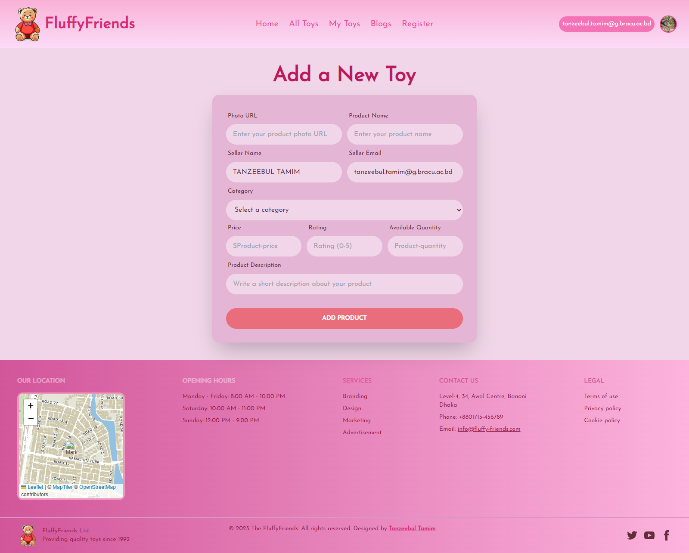

# Fluffy Friends - Client Side

Welcome to the client-side repository of Fluffy Friends, a soft toy marketplace.

## Table of Contents
- [Website Features](#website-features)
- [Live Deployment](#live-deployment)
- [Used Packages and Technologies](#used-packages-and-technologies)
- [Prerequisites](#prerequisites)
- [Installation](#installation)
- [Running the Project](#running-the-project)
- [Also checkout Fluffy Friends Server](#also-checkout-fluffy-friends-server)
- [Contributing](#contributing)
- [License](#license)

## Website Features

- ***Visually Appealing Design:*** The website is designed with a unique and visually appealing layout, ensuring proper alignment, color contrast, and customization of component libraries.
<p align="center">
  
</p>

<br/>

- ***Dynamic Home Page:*** The homepage features a top slider section, a toy gallery section, sorty by categories section, toy care blogs and a testimonial section implemented with animations.
<p align="center">
   
</p>

<br/>

- ***Footer:*** A meaningful footer is present on all pages, including a mini map, ensuring consistency and providing essential links or information.
<p align="center">
  
</p>

- ***Responsive Navigation Bar:*** The navbar includes the website logo, Home, All Toys, My Toys, Blogs, Register and User Profile Picture. It dynamically shows the Login button or user profile picture based on user authentication status.
<p align="center">
   
</p>

<br/>

- ***Registration & Login System:*** The website supports user registration and login with fields for name, email, password and photo URL. Social login is also integrated.
  - ***Login:***
  <p align="center">
     
  </p>

  - ***Register:***
  <p align="center">
     
  </p>

<br/>

- ***All Toys Page:*** Users can search for toys, check availability, view price, seller info and details of each toys individually in a separate page allocated for each toy item.
  <p align="center">
     
  </p>

  <br/>

- ***Add a Toy:*** Users can add their own toy in the marketplace. It has fields for photo url, product name, seller name and email, category, price, rating, available quantity and product description.
  <p align="center">
    
  </p>

<br/>

- ***My Toys:*** Sellers can see their own toys that they have added to the marketplace along with the product details such as product name, category, price and available quanity. Users can sort the list by price in ascending or descending order. Items can also be updated or deleted from the market place via this page.
  <p align="center">
    
  </p>

<br/>

- ***404 Page:*** A custom 404 page is created with an added picture, enhancing the user experience in case of page not found errors.
<p align="center">
  
</p>

<br/>

## Live Deployment

Check out the live site [at this following URL](https://fluffy-friends-3152f.web.app/)

## Used Packages and Technologies

- **React**: Core library for building user interfaces
- **React Router**: For routing and navigation
- **Tailwind CSS**: Utility-first CSS framework
- **DaisyUI**: Tailwind CSS components
- **Axios**: For making HTTP requests
- **Firebase**: For authentication
- **AOS**: For animations on scroll
- **LocalForage**: For offline storage
- **Match Sorter**: For sorting and filtering
- **React Icons**: For icons
- **React Leaflet**: For interactive maps
- **React Loading**: For loading spinners
- **React Rating**: For rating components
- **React Tabs**: For tabbed navigation
- **React Toastify**: For toast notifications
- **SweetAlert2**: For beautiful alerts

## Prerequisites

- Node.js
- npm

## Installation

1. Clone the repository:
   ```sh
   git clone https://github.com/Tanzeebul-Tamim/Fluffy-Friends-Client
   cd Fluffy-Friends-Client
   ```
2. Install dependencies:
   ```sh
   npm install
   ```
3. Create a `.env` file and add your environment variables:
   ```sh
   PORT=5000
   DB_USER=your_db_user
   DB_PASS=your_db_password
   MONGODB_URI=your_mongodb_connection_string
   ```

## Running the Project

```sh
npm run dev
```

## Also checkout Fluffy-Friends-Server

Visit the server-side repository of [Fluffy Friends](https://github.com/Tanzeebul-Tamim/Fluffy-Friends-Server) website

## Contributing

Feel free to contribute by submitting a pull request. Please ensure that your code follows the project's coding standards and includes relevant tests.

## License

This project is licensed under the MIT License - see the [LICENSE](LICENSE) file for details.
